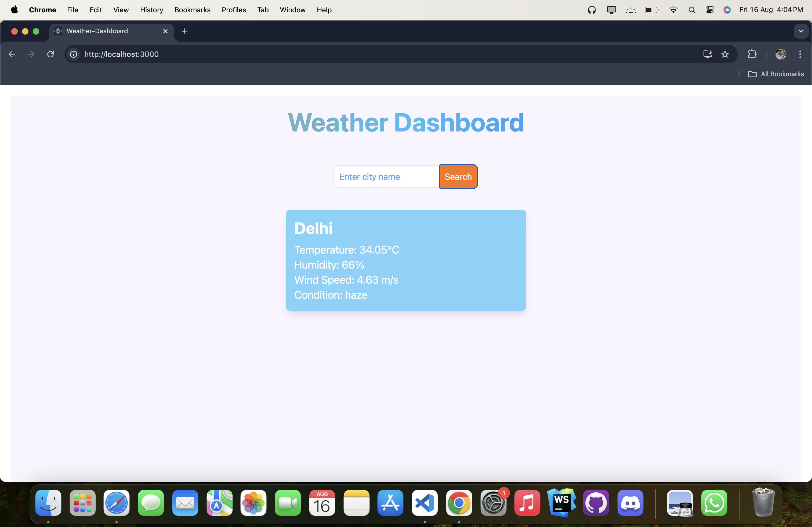
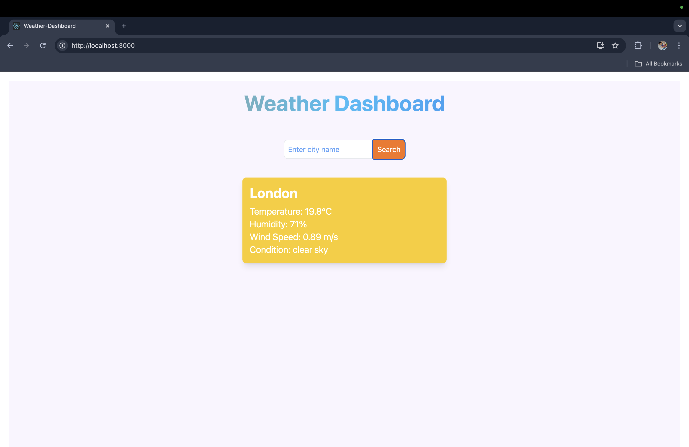
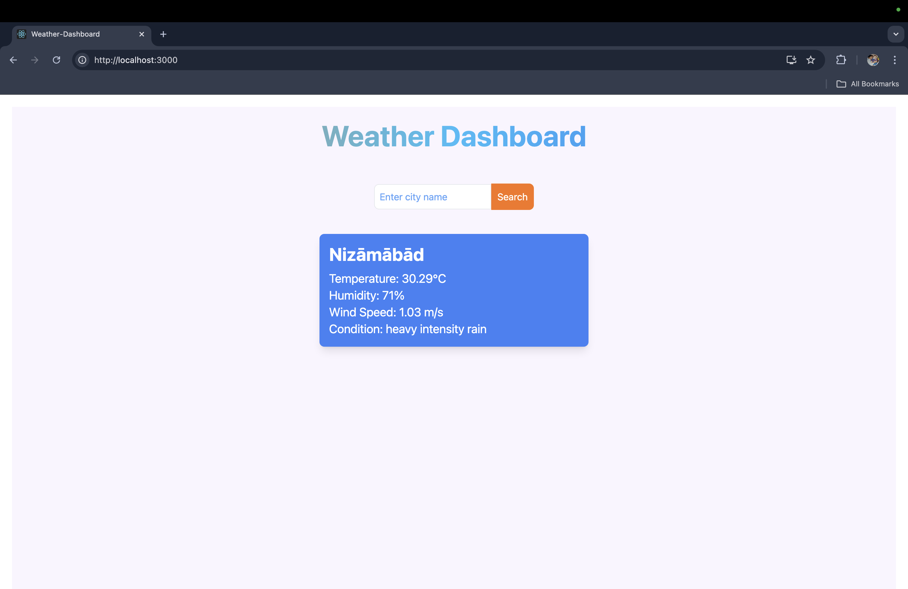
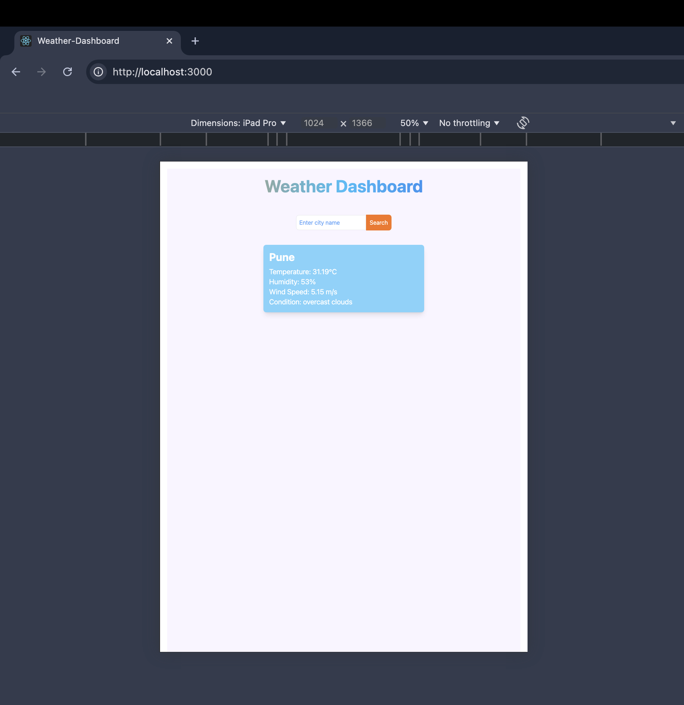
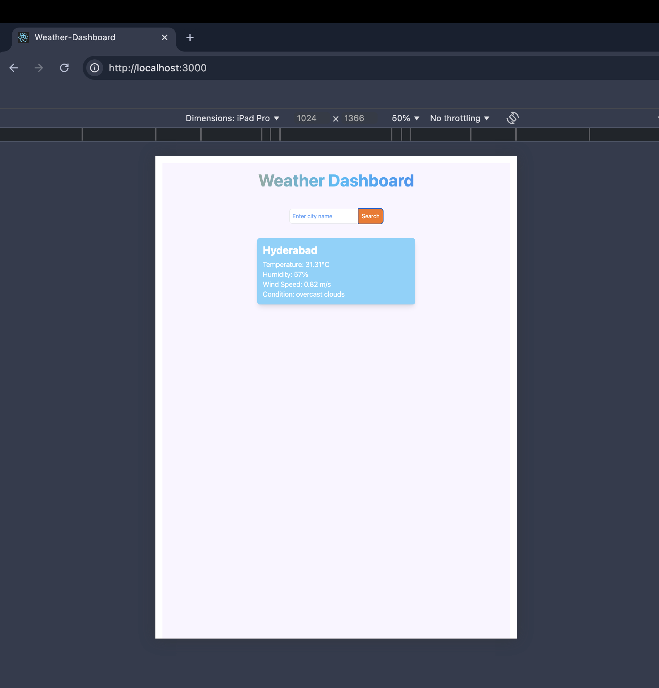
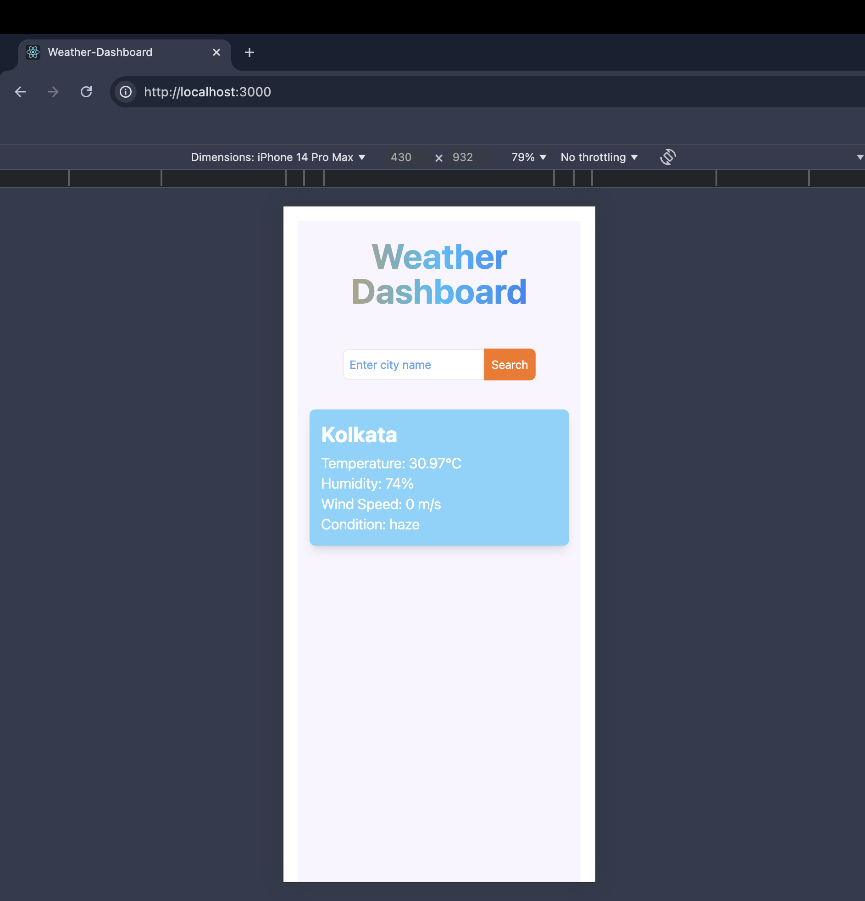
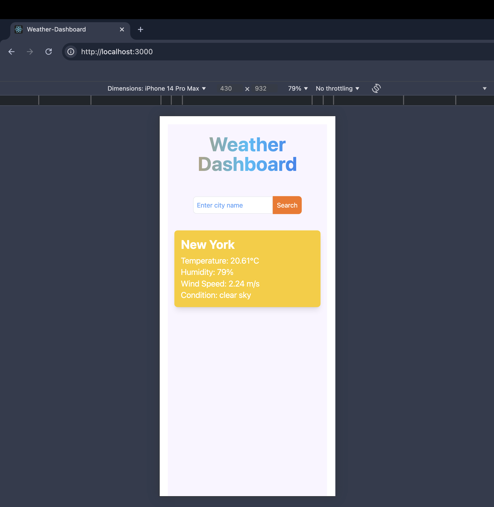

# Getting Started with Create React App

This project was bootstrapped with [Create React App](https://github.com/facebook/create-react-app).

## Features

- **Search Functionality:**  Search for current weather information by city name.
- **Weather Details:** Displays temperature, humidity, wind speed, and weather condition.
- **Responsive Design:** Optimized for both desktop and mobile views.
- **Background:** Dynamic Background effect changes based on weather conditions.

## Tech Stack

- **Frontend:**
  - React
  - Tailwind CSS
  - JavaScript
  - HTML

- **APIs:**
  - OpenWeatherMap API for fetching weather data.

## Available Scripts

In the project directory, you can run:

### Installation
1. **Clone the Repository:**
2. `cd weather-dashboard`
3. `npm install`
4. **API Key:** OpenWeatherMap API key is used in the **App.js** and   **api.js** file.
    
### `npm start`

Runs the app in the development mode.\
Open [http://localhost:3000](http://localhost:3000) to view it in your browser.

The page will reload when you make changes.\
You may also see any lint errors in the console.

**Acknowledgements:-**

*Tailwind CSS*- For utility-first CSS framework.
*OpenWeatherMap* - For Current weather data API.
*React* - For building user interfaces.

**Some Images of the project:-**

*Ipad view*

*Mobile View:-*

